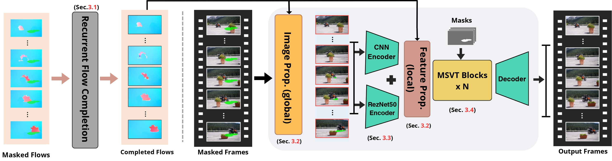

# Dual-Encoder Video Inpainting
**Rahaf Jaber, Saeed Anwar, Muhammad Usman, Omar Hammad**
## Overview

This repository provides the official PyTorch implementation of our paper:

📄 **Video Inpainting with Dual-Encoder Enhancement: Striking the Balance Between Accuracy and Efficiency**  
We introduce a **dual-encoder video inpainting model** that integrates both lightweight CNN and ResNet-50 encoders to enhance spatial detail and semantic context. The model builds upon ProPainter and outperforms previous state-of-the-art approaches such as E2FGVI in quality–efficiency trade-offs.

---

## Contents
- [Introduction](#introduction)  
- [Methodology](#network)  
- [Train](#train)  
- [Test](#test)  
- [Results](#results)  
- [Citation](#citation)  
- [Acknowledgements](#acknowledgements)  

---

## Introduction  
Transformer-based video inpainting models like ProPainter achieve strong results but struggle to balance **efficiency and feature richness**. This paper introduces a **single-stage dual-encoder transformer-based video inpainting model**. We incorporate a **lightweight CNN encoder** to extract low-level textures and a **ResNet-50 encoder** for high-level semantic context. These features are fused and refined using a **mask-guided sparse transformer**.

The proposed model outperforms state-of-the-art approaches such as **ProPainter** and **E2FGVI** in both **visual quality** and **runtime performance**, evaluated on standard benchmarks like **DAVIS**.

---

## Methodology

The architecture of the proposed video inpainting network is shown below. It consists of the following modules:
- **Recurrent Flow Completion (RFC)**  
- **Dual-Domain Propagation (DDP)**  
- **Dual-Encoder Feature Extraction** (CNN + ResNet-50)  
- **Mask-Guided Sparse Video Transformer (MSVT)**

  

---
## Train  
*Will be added soon.*

---

## Test  
*Will be added soon.*

---

## Results

**Performance on DAVIS Dataset:**
**Quantitative Results:**

| Model               | PSNR ↑ | SSIM ↑  | VFID ↓ | Runtime ↓ |
|--------------------|--------|---------|--------|-----------|
| ProPainter         | 33.02  | 0.9627  | 0.115  | 0.057 s   |
| E2FGVI             | 33.01  | 0.9721  | 0.116  | 0.085 s   |
| Ours (ResNet-50)   | **33.77** | 0.9660  | **0.115**  | **0.049 s** |
| Ours (Efficient)   | 32.96  | 0.9622  | 0.117  | **0.042 s** |

The model offers a superior trade-off between **visual fidelity and computational speed**, achieving real-time performance on consumer-grade GPUs.

**Visual Results:**

  

Above: Visual comparison on DAVIS. From left to right — masked frame, FuseFormer, FGT, E2FGVI, ProPainter, Ours (ResNet-50), and Ours (Swin). Our dual-encoder models yield sharper textures, intact edges, and reduced artifacts.
---
## Acknowledgement

This code is built on [ProPainter](https://github.com/sczhou/ProPainter)
